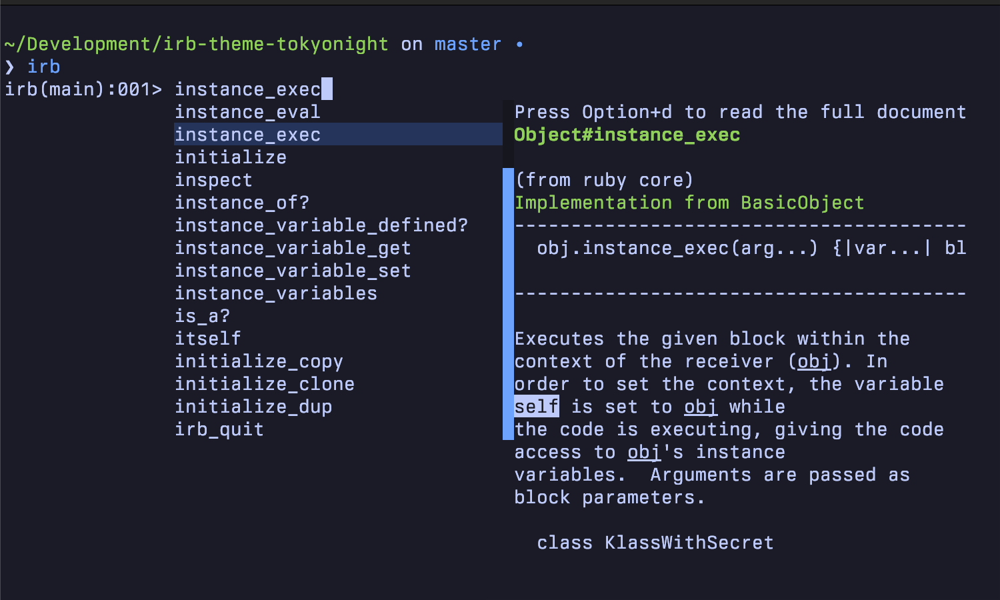
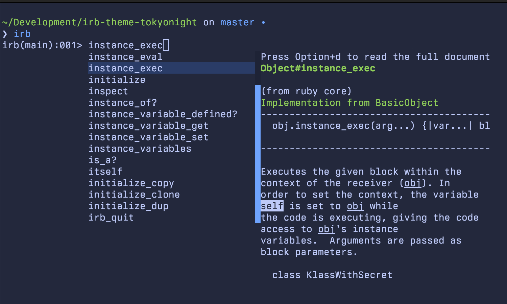
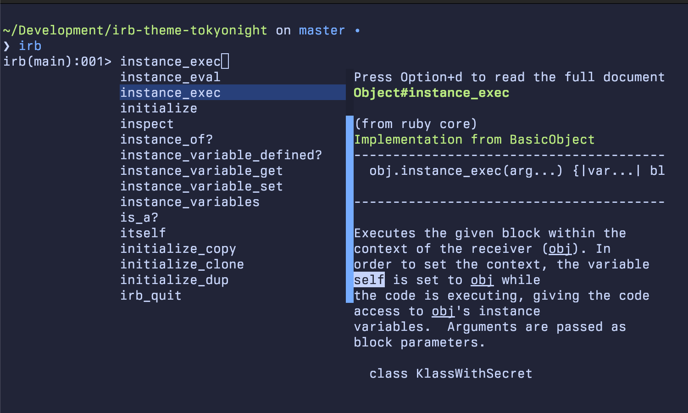
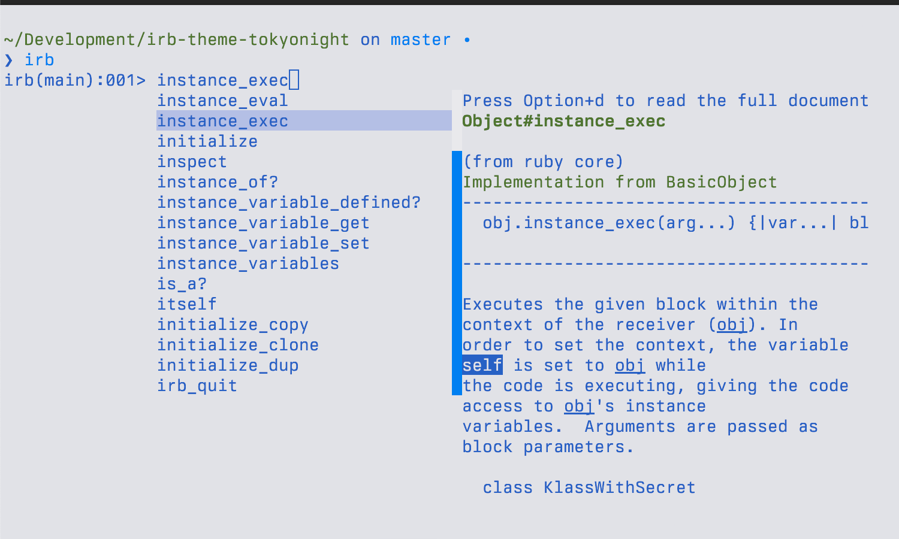

# Irb::Theme::Tokyonight

[Tokyo Night colors](https://github.com/folke/tokyonight.nvim) for [`Reline`](https://github.com/ruby/reline) (IRB). This gem is inspired
by [a similar gem](https://github.com/katsyoshi/irb-theme-dracula) featuring the `Dracula` theme.

## Installation

Install the gem and add to the application's Gemfile by executing:

```shell
bundle add require irb-theme-tokyonight
```

If bundler is not being used to manage dependencies, install the gem by executing:

```shell
gem install irb-theme-tokyonight
```

## Usage

Add one of the following `require` statements to your `.irbrc` file:

### Night

```ruby
require 'irb/theme/tokyonight/night'
```



### Storm

```ruby
require 'irb/theme/tokyonight/storm'
```



### Moon

```ruby
require 'irb/theme/tokyonight/moon'
```



### Day

```ruby
require 'irb/theme/tokyonight/day'
```



## Development

After checking out the repo, run `bin/setup` to install dependencies. You can also run `bin/console` for an interactive prompt that will allow you to experiment.

To install this gem onto your local machine, run `bundle exec rake install`. To release a new version, update the version number in `version.rb`, and then run `bundle exec rake release`, which will create a git tag for the version, push git commits and the created tag, and push the `.gem` file to [rubygems.org](https://rubygems.org).

## Contributing

Bug reports and pull requests are welcome on GitHub at <https://github.com/vitallium/irb-theme-tokyonight>.

## License

The gem is available as open source under the terms of the [MIT License](https://opensource.org/licenses/MIT).
